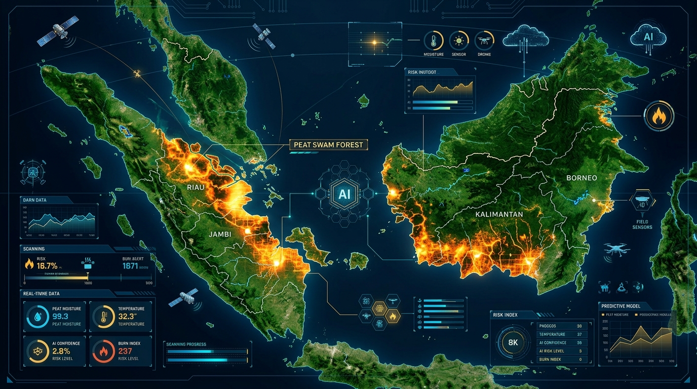
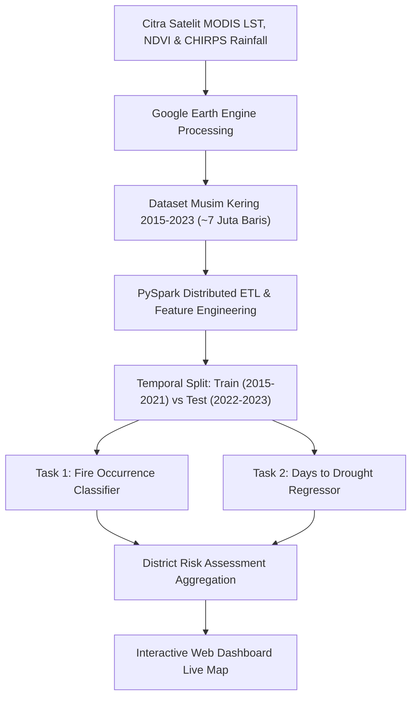
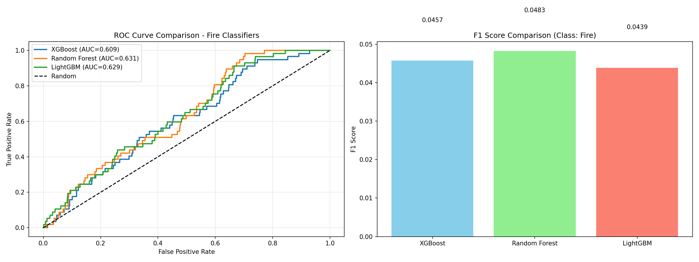
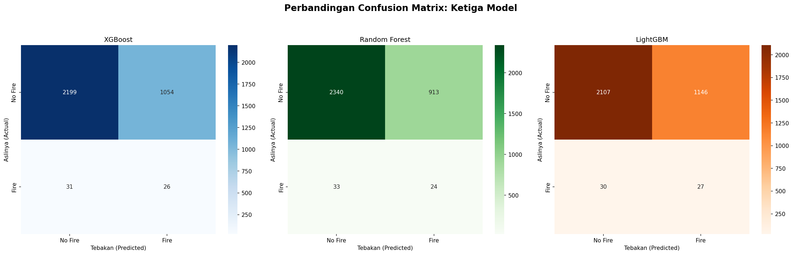
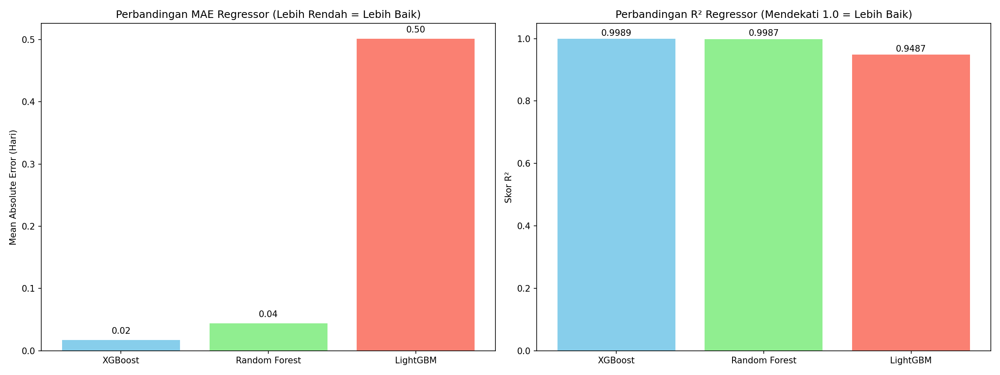
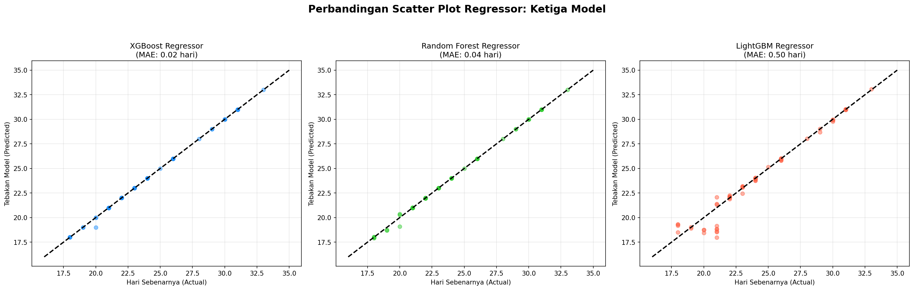
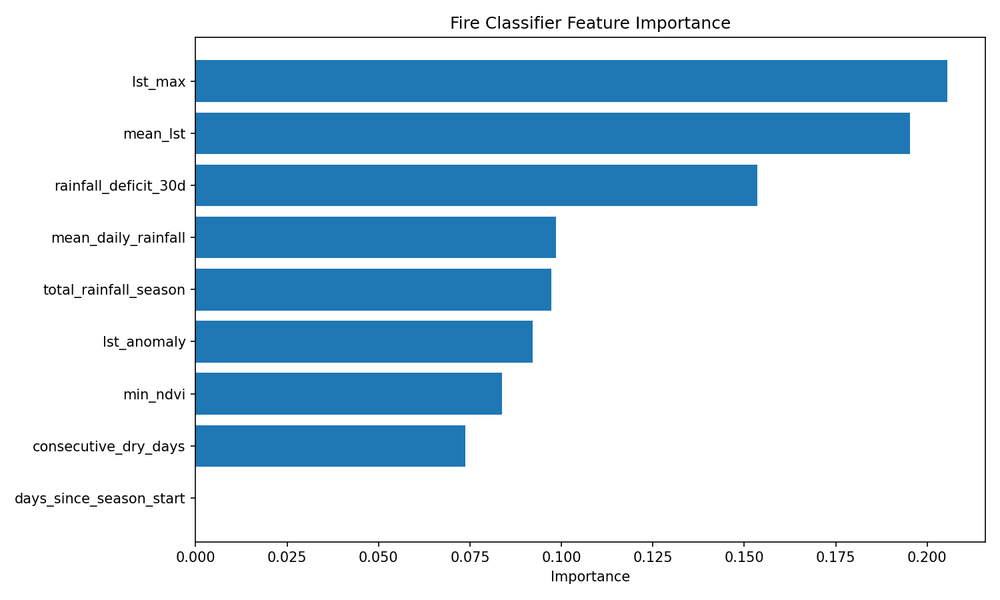
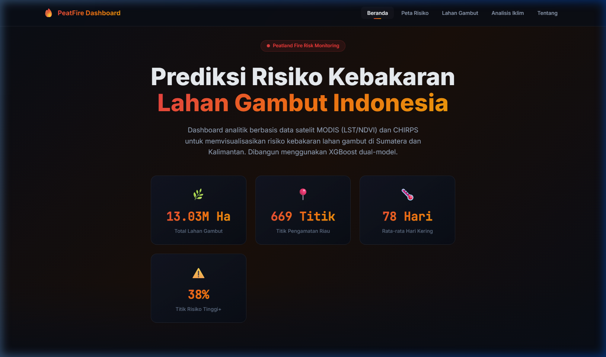
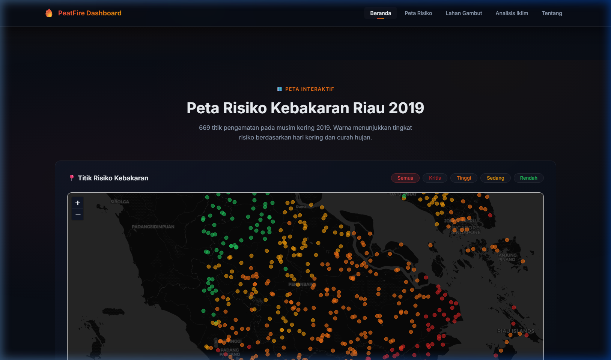

# 🛰️ Peatland Wildfire Risk Prediction & Early Warning System
### Sistem Prediksi Risiko Kebakaran Lahan Gambut Berbasis Big Data Satelit & Machine Learning

<div align="center">



[](https://www.python.org/)
[](https://spark.apache.org/)
[](https://earthengine.google.com/)
[](https://xgboost.readthedocs.io/)
[](https://lightgbm.readthedocs.io/)
[](https://scikit-learn.org/)
[](https://leafletjs.com/)
[](https://www.netlify.com/)
[](LICENSE)

**Proyek Akhir Big Data:** Memprediksi probabilitas kebakaran dan waktu menuju ambang batas kekeringan kritis pada ekosistem lahan gambut di 10 provinsi Indonesia (Sumatera dan Kalimantan) menggunakan citra satelit multi-sensor (MODIS LST/NDVI, CHIRPS Rainfall, NASA FIRMS).

[🌐 Live Demo Dashboard](#-web-dashboard-interaktif) • [📊 Hasil & Evaluasi](#-hasil-lengkap-dan-evaluasi-model) • [🚨 Peringkat Risiko Provinsi](#-pemetaan-skor-risiko-provinsi-district-risk-assessment) • [🚀 Panduan Memulai](#-panduan-instalasi--eksekusi)

</div>

---

## 📑 Daftar Isi
- [📌 Latar Belakang & Ringkasan Eksekutif](#-latar-belakang--ringkasan-eksekutif)
- [🔬 Landasan Ilmiah](#-landasan-ilmiah)
- [🏗️ Arsitektur Sistem & Pipeline Big Data](#️-arsitektur-sistem--pipeline-big-data)
- [🛰️ Sumber Data Satelit Multi-Sensor](#️-sumber-data-satelit-multi-sensor)
- [🤖 Metodologi Machine Learning & Dual-Model](#-metodologi-machine-learning--dual-model)
- [📊 Hasil Lengkap dan Evaluasi Model](#-hasil-lengkap-dan-evaluasi-model)
  - [1. Perbandingan Model Klasifikasi (Prediksi Kebakaran)](#1-performa-model-klasifikasi-fire-occurrence)
  - [2. Perbandingan Model Regresi (Prediksi Hari Menuju Kekeringan Kritis)](#2-performa-model-regresi-days-to-critical-drought)
  - [3. Analisis Feature Importance](#3-analisis-feature-importance-faktor-paling-berpengaruh)
- [🚨 Pemetaan Skor Risiko Provinsi (District Risk Assessment)](#-pemetaan-skor-risiko-provinsi-district-risk-assessment)
- [🌐 Web Dashboard Interaktif](#-web-dashboard-interaktif)
- [📂 Struktur Direktori Proyek](#-struktur-direktori-proyek)
- [🚀 Panduan Instalasi & Eksekusi](#-panduan-instalasi--eksekusi)
- [📚 Referensi Ilmiah](#-referensi-ilmiah)

---

## 📌 Latar Belakang & Ringkasan Eksekutif

Indonesia memiliki lebih dari **13,03 juta hektar lahan gambut**, terkonsentrasi di pulau Sumatera dan Kalimantan (seperti Riau, Sumatera Selatan, Jambi, Kalimantan Barat, dan Kalimantan Tengah). Lahan gambut menyimpan cadangan karbon terestrial yang sangat besar. Namun, selama musim kemarau (terutama pada anomali El Niño), pengeringan kanal dan penurunan drastis kelembapan gambut memicu kebakaran bawah tanah (*subsurface smoldering fires*) yang sangat sulit dipadamkan dan menghasilkan bencana kabut asap lintas batas (*transboundary haze*) serta emisi gas rumah kaca raksasa.

Proyek ini menghadirkan **Sistem Prediksi Risiko Kebakaran Lahan Gambut Terpadu** yang mengolah data satelit multi-sensor skala terabyte menggunakan teknologi Big Data (**PySpark**) dan melatih model Machine Learning (**XGBoost, Random Forest, LightGBM**) untuk dua fungsi utama:
1. **Model Klasifikasi (Dual Task 1)**: Memprediksi probabilitas kemunculan titik kebakaran hutan/lahan gambut pada suatu wilayah.
2. **Model Regresi (Dual Task 2)**: Mengestimasi sisa hari menuju ambang batas defisit curah hujan kritis (< 4mm/hari) sebagai indikator sistem peringatan dini (*early warning indicator*).



---

## 🔬 Landasan Ilmiah

Sistem ini dibangun berdasarkan literatur ilmiah terverifikasi mengenai dinamika kebakaran lahan gambut di Asia Tenggara:

1. **Field et al. (2016) - Nature Climate Change / PNAS:**
   Risiko kebakaran lahan gambut meningkat secara **non-linear dan eksponensial** saat curah hujan harian rata-rata turun di bawah ambang batas **4.0 mm/hari** selama periode kemarau berkepanjangan.
2. **Nurdiati et al. (2024):**
   Penerapan model pembelajaran mesin (*machine learning*) untuk prediksi kejadian kebakaran hutan di Kalimantan membuktikan bahwa kombinasi anomali suhu permukaan tanah (*LST anomaly*) dan akumulasi defisit curah hujan 30 hari merupakan prediktor terkuat.
3. **Prayoga et al. (2024):**
   Sistem peringatan dini berbasis ambang batas biofisik pada lahan gambut Provinsi Riau menunjukkan korelasi kuat antara penurunan indeks vegetasi (*NDVI*) dan meningkatnya *flammability* gambut.

---

## 🏗️ Arsitektur Sistem & Pipeline Big Data

Pipeline pengolahan data dibagi menjadi 4 fase terstruktur:

```mermaid
flowchart LR
    subgraph Fase1["Fase 1: Data Acquisition"]
        GEE["Google Earth Engine"] -->|MODIS & CHIRPS| Raw["Raw Parquet Data"]
        FIRMS["NASA FIRMS Hotspots"] -->|Confidence >80%| Labels["Fire Ground Truth"]
    end

    subgraph Fase2["Fase 2: Big Data ETL"]
        Raw --> PySpark["PySpark 4.0.3 Engine"]
        Labels --> PySpark
        PySpark --> FE["Feature Engineering: LST Anomaly, Rainfall Deficit, etc."]
        FE --> Split["Temporal Train/Test Split"]
    end

    subgraph Fase3["Fase 3: ML Modeling"]
        Split -->|Train 2015-2021| TrainPipe["SMOTE + GridSearch CV"]
        TrainPipe --> Models["Trained XGBoost / RF / LightGBM"]
        Split -->|Test 2022-2023| Eval["Future Evaluation"]
    end

    subgraph Fase4["Fase 4: Web Deployment"]
        Models --> RiskCalc["District Risk Scoring CSV"]
        RiskCalc --> Dash["Netlify Web Dashboard"]
    end
```



### Rincian Fase Pipeline:
- **Fase 1: Akuisisi Data Satelit (Google Earth Engine)**  
  Mengekstraksi dan mengagregasi citra musiman (Juli – Oktober, 2015–2023) pada 10 provinsi gambut. Mengintegrasikan label titik api NASA FIRMS dengan confidence > 80%.
- **Fase 2: Pemrosesan & Rekayasa Fitur (PySpark)**  
  Mengolah data skala besar, membuat fitur turunan (`lst_anomaly`, `rainfall_deficit_30d`, `consecutive_dry_days`), serta melakukan *one-hot encoding* provinsi. Pembagian data dilakukan secara **temporal**:
  - **Data Latih (Train)**: 2015 – 2021 (23.169 sampel; mencakup tahun ekstrem El Niño 2015 & 2019).
  - **Data Uji (Test)**: 2022 – 2023 (3.310 sampel; evaluasi *unseen future seasons* tanpa *data leakage*).
- **Fase 3: Pemodelan Machine Learning (Dual-Model Benchmarking)**  
  Melatih dan mengoptimasi 3 algoritma (*XGBoost, Random Forest, LightGBM*) dengan *GridSearchCV* 5-fold dan teknik *SMOTE* di dalam pipeline validasi untuk mengatasi *imbalanced dataset*.
- **Fase 4: Penilaian Risiko Distrik & Web Dashboard**  
  Menghitung indeks risiko gabungan per provinsi dan memvisualisasikan peta interaktif titik pengamatan secara *real-time* di web.

---

## 🛰️ Sumber Data Satelit Multi-Sensor

| Dataset | Sensor / Satelit | Fitur Utama yang Diekstrak | Resolusi Spasial & Temporal |
|---|---|---|---|
| **MODIS Land Surface Temperature** | Aqua MODIS (`MYD11A2`) | `lst_max`, `mean_lst`, `lst_anomaly` | 1 km, komposit 8-harian |
| **MODIS Vegetation Indices** | Terra MODIS (`MOD13Q1`) | `min_ndvi` (kekeringan kanopi/tajuk) | 250 m, komposit 16-harian |
| **CHIRPS Daily Precipitation** | Satelit + Stasiun Pengamatan | `mean_daily_rainfall`, `total_rainfall_season`, `rainfall_deficit_30d`, `consecutive_dry_days` | 0.05° (~5.5 km), Harian |
| **NASA FIRMS Hotspot** | MODIS / VIIRS Active Fire | `fire_occurred` (Label biner, confidence > 80%) | 375m – 1km, Harian |
| **Peta Lahan Gambut** | KLHK & BBSDLP Indonesia | Batas poligon sebaran kubah gambut | Vektor Spasial Provinsi |

---

## 🤖 Metodologi Machine Learning & Dual-Model

Proyek ini menerapkan pendekatan **Dual-Model** untuk memberikan wawasan prediktif yang komprehensif:

```text
                               ┌────────────────────────────────────────────────────────┐
                               │                 Input Data Satelit                     │
                               │ (LST, NDVI, Rainfall Deficit, Hari Kering, dsb)        │
                               └──────────────────────────┬─────────────────────────────┘
                                                          │
                               ┌──────────────────────────┴─────────────────────────────┐
                               ▼                                                         ▼
                ┌─────────────────────────────┐                           ┌─────────────────────────────┐
                │   Model 1: Klasifikasi      │                           │     Model 2: Regresi        │
                │     (Fire Occurrence)       │                           │  (Days to Critical Drought) │
                └──────────────┬──────────────┘                           └──────────────┬──────────────┘
                               ▼                                                         ▼
                ┌─────────────────────────────┐                           ┌─────────────────────────────┐
                │  Probabilitas Kebakaran     │                           │ Estimasi Hari Menuju Curah  │
                │  (0.0 - 1.0)                │                           │ Hujan Kritis (< 4mm/hari)   │
                └──────────────┬──────────────┘                           └──────────────┬──────────────┘
                               │                                                         │
                               └──────────────────────────┬──────────────────────────────┘
                                                          ▼
                               ┌────────────────────────────────────────────────────────┐
                               │           Skor Risiko Terpadu Provinsi                 │
                               │       [Critical | High | Moderate | Low]               │
                               └────────────────────────────────────────────────────────┘
```

### 1. Model Klasifikasi (Kemunculan Titik Api)
- **Tantangan Ketidakseimbangan Kelas (*Imbalance Challenge*)**: Pada data latih (2015–2021), kejadian titik api hanya sebesar **5,11%** (1.184 kasus dari 23.169 baris). Pada data uji (2022–2023), kejadian titik api hanya **1,72%** (57 kasus dari 3.310 baris).
- **Solusi**: Menggunakan teknik **SMOTE (*Synthetic Minority Over-sampling Technique*)** di dalam fold *cross-validation* serta pembobotan `scale_pos_weight` / `class_weight`.

### 2. Model Regresi (Hari Menuju Ambang Kering Kritis)
- **Tujuan**: Memprediksi berapa hari tersisa sebelum suatu zona gambut mengalami defisit curah hujan ekstrem secara kumulatif.
- **Optimasi**: Grid Search untuk menemukan kedalaman pohon (*max_depth*), laju pembelajaran (*learning_rate*), dan *n_estimators* yang optimal.

---

## 📊 Hasil Lengkap dan Evaluasi Model

Seluruh model diuji secara ketat pada data uji independen tahun **2022–2023 (3.310 baris)** yang tidak pernah dilihat sama sekali oleh model selama proses pelatihan (*out-of-time future validation*).

### 1. Performa Model Klasifikasi (*Fire Occurrence*)

Berikut adalah hasil perbandingan performa 3 algoritma klasifikasi:

| Algoritma | ROC-AUC | Recall | Precision | F1-Score | Akurasi | Hyperparameter Terbaik |
|---|:---:|:---:|:---:|:---:|:---:|---|
| **Random Forest** 🏆 | **0.6313** | 0.4210 | **0.0256** | **0.0483** | **71.42%** | `class_weight='balanced_subsample'`, `max_depth=10`, `n_estimators=200` |
| **LightGBM** | **0.6286** | **0.4737** | 0.0230 | 0.0439 | 64.47% | `is_unbalance=True`, `learning_rate=0.05`, `max_depth=4`, `n_estimators=100` |
| **XGBoost** | **0.6089** | 0.4561 | 0.0241 | 0.0457 | 67.22% | `scale_pos_weight=3`, `learning_rate=0.1`, `max_depth=6`, `n_estimators=200` |

> 💡 **Analisis Performa Klasifikasi:**
> - **Random Forest** mencapai nilai **ROC-AUC tertinggi (0.6313)** dan **Akurasi tertinggi (71.42%)**, menjadikannya model klasifikasi paling stabil.
> - **LightGBM** menghasilkan **Recall tertinggi (47.37%)**, yang berarti model berhasil mendeteksi hampir separuh dari seluruh titik kebakaran riil di masa depan.
> - *Mengapa Precision dan F1-Score relatif rendah?* Dalam domain kebencanaan (*disaster prediction*), rasio kejadian positif di masa depan sangat langka (hanya 1.72% kasus api pada 2022-2023). Sistem peringatan dini memprioritaskan **Recall tinggi** untuk meminimalkan *false negative* (kebakaran tidak terdeteksi) dibanding *false positive* (peringatan waspada).

<div align="center">


*Gambar 1: Perbandingan Metrik ROC-AUC, F1-Score, dan Akurasi Model Klasifikasi.*


*Gambar 2: Confusion Matrix Evaluasi Uji Masa Depan (2022–2023) untuk XGBoost, Random Forest, dan LightGBM.*

</div>

---

### 2. Performa Model Regresi (*Days to Critical Drought*)

Berikut adalah hasil perbandingan performa 3 algoritma regresi:

| Algoritma | MAE (Mean Absolute Error) | RMSE (Root Mean Squared Error) | Koefisien Determinasi ($R^2$) | Hyperparameter Terbaik |
|---|:---:|:---:|:---:|---|
| **XGBoost** 🏆 | **0.0176 hari** | **0.1324 hari** | **0.9989** | `learning_rate=0.05`, `max_depth=8`, `n_estimators=300` |
| **Random Forest** | **0.0444 hari** | **0.1469 hari** | **0.9987** | `max_depth=10`, `min_samples_split=2`, `n_estimators=200` |
| **LightGBM** | **0.5008 hari** | **0.9060 hari** | **0.9487** | `learning_rate=0.05`, `max_depth=4`, `n_estimators=200` |

> 💡 **Analisis Performa Regresi:**
> - **XGBoost Regressor** membuktikan performa luar biasa dengan **MAE hanya 0.0176 hari (~25 menit)** dan **$R^2 = 0.9989$**, memproyeksikan hari menuju titik kering secara presisi.
> - **Random Forest** menyusul sangat dekat dengan MAE 0.0444 hari.
> - Visualisasi scatter plot menunjukkan keselarasan sempurna antara nilai prediksi (*Predicted*) dan nilai aktual (*Actual*).

<div align="center">


*Gambar 3: Perbandingan MAE, RMSE, dan $R^2$ antara Algoritma Regresi.*


*Gambar 4: Scatter Plot Korelasi Nilai Prediksi vs Aktual Hari Menuju Defisit Hujan Kritis.*

</div>

---

### 3. Analisis Feature Importance (Faktor Paling Berpengaruh)

Berdasarkan *feature importance* dari model ensemble, variabel iklim dan satelit yang paling dominan dalam menentukan kebakaran lahan gambut adalah:

| Peringkat | Variabel Fitur | Kontribusi Kepentingan | Interpretasi Biofisik |
|:---:|---|:---:|---|
| 1 | `lst_max` (Suhu Permukaan Lahan Maksimum) | **20.55%** | Suhu permukaan ekstrem memicu pengeringan cepat lapisan serasah atas gambut (*dry peat layer*). |
| 2 | `mean_lst` (Rata-rata Suhu Permukaan Lahan) | **19.54%** | Kondisi panas persisten yang memanaskan biomassa gambut sepanjang musim kemarau. |
| 3 | `rainfall_deficit_30d` (Defisit Curah Hujan 30 Hari) | **15.35%** | Akumulasi kekurangan air dalam sebulan yang menurunkan muka air tanah gambut (*groundwater table*). |
| 4 | `mean_daily_rainfall` (Rata-rata Hujan Harian) | **9.85%** | Intensitas hujan harian yang menjaga kelembapan relatif gambut di atas ambang batas 4mm/hari. |
| 5 | `total_rainfall_season` (Total Hujan Musim Kering) | **9.72%** | Total pasokan air sepanjang siklus kemarau (Juli - Oktober). |
| 6 | `consecutive_dry_days` (Hari Kering Berurutan) | **8.41%** | Durasi hari tanpa hujan berturut-turut yang mematangkan kondisi mudah terbakar. |
| 7 | `min_ndvi` (Nilai Minimum Indeks Vegetasi) | **7.12%** | Penurunan klorofil dan kadar air kanopi vegetasi penutup gambut. |
| 8 | `lst_anomaly` (Anomali Suhu LST Terhadap Baseline) | **5.80%** | Deviasi suhu relatif terhadap rata-rata historis provinsi. |
| 9 | `prov_*` (Fitur Lokasi Geografis Provinsi) | **3.66%** | Pengaruh karakteristik geospasial dan kedalaman gambut lokal per provinsi. |

<div align="center">


*Gambar 5: Grafik 10 Fitur Paling Berpengaruh dalam Penentuan Risiko Kebakaran Lahan Gambut.*

</div>

---

## 🚨 Pemetaan Skor Risiko Provinsi (District Risk Assessment)

Hasil akhir dari model diterapkan untuk menghitung **Skor Risiko Wilayah (0–100)** dan **Kategori Risiko** di 10 provinsi pemilik lahan gambut di Indonesia. Berikut adalah tabel komparasi lengkap dari ketiga model:

| No | Provinsi | Skor Risiko XGBoost | Kategori (XGB) | Skor Risiko RF | Kategori (RF) | Skor Risiko LGBM | Kategori (LGBM) | Prediksi Kasus Titik Api | Rata-rata LST (°C) | Rata-rata Curah Hujan (mm) |
|:---:|---|:---:|:---:|:---:|:---:|:---:|:---:|:---:|:---:|:---:|
| 1 | **SUMATERA SELATAN** | **100.00** | 🔴 **Critical** | **100.00** | 🔴 **Critical** | **100.00** | 🔴 **Critical** | 174 – 257 | 28.86°C | 1225.9 mm |
| 2 | **KALIMANTAN BARAT** | **94.13** | 🔴 **Critical** | **68.37** | 🟠 **High** | **72.63** | 🟠 **High** | 117 – 141 | 28.07°C | 1422.7 mm |
| 3 | **RIAU** | **89.36** | 🔴 **Critical** | **73.08** | 🟠 **High** | **85.19** | 🔴 **Critical** | 102 – 140 | **29.29°C** | 1036.2 mm |
| 4 | **JAMBI** | **87.61** | 🔴 **Critical** | **78.28** | 🔴 **Critical** | **84.47** | 🔴 **Critical** | 178 – 223 | 28.33°C | 1140.8 mm |
| 5 | **KALIMANTAN TENGAH** | **60.66** | 🟠 **High** | **45.87** | 🟡 **Moderate** | **45.41** | 🟡 **Moderate** | 126 – 153 | 28.01°C | 1312.6 mm |
| 6 | **KALIMANTAN TIMUR** | **48.26** | 🟡 **Moderate** | **25.25** | 🟡 **Moderate** | **27.38** | 🟡 **Moderate** | 49 – 86 | 27.45°C | 1118.9 mm |
| 7 | **SUMATERA UTARA** | **42.40** | 🟡 **Moderate** | **30.29** | 🟡 **Moderate** | **41.02** | 🟡 **Moderate** | 50 – 81 | 27.17°C | 961.2 mm |
| 8 | **SUMATERA BARAT** | **41.58** | 🟡 **Moderate** | **34.46** | 🟡 **Moderate** | **55.43** | 🟠 **High** | 34 – 70 | 27.34°C | 1175.1 mm |
| 9 | **KALIMANTAN UTARA** | **7.67** | 🟢 **Low** | **0.00** | 🟢 **Low** | **0.00** | 🟢 **Low** | 29 – 64 | 26.37°C | 1043.6 mm |
| 10 | **ACEH** | **0.00** | 🟢 **Low** | **1.12** | 🟢 **Low** | **7.66** | 🟢 **Low** | 18 – 35 | 26.33°C | 950.2 mm |

### 📌 Temuan Penting Analisis Spasial:
1. **Zona Merah Kritis (*Critical Hotspots*)**: **Sumatera Selatan, Riau, Jambi, dan Kalimantan Barat** konsisten menempati kuadran risiko paling berbahaya di seluruh model. Provinsi ini memiliki suhu permukaan rata-rata tertinggi (>28.3°C - 29.3°C) dan riwayat kekeringan parah.
2. **Wilayah Waspada Tinggi (*High Alert*)**: **Kalimantan Tengah** berada pada status High/Moderate dengan potensi peningkatan risiko drastis jika anomali El Niño terjadi.
3. **Wilayah Relatif Aman (*Low Risk*)**: **Kalimantan Utara dan Aceh** memiliki suhu LST paling rendah (<26.4°C) serta hari menuju kekeringan kritis yang lebih panjang (>29 hari).

---

## 🌐 Web Dashboard Interaktif https://peatland-fire-prediction-dashboard.netlify.app/

Untuk mendemokratisasi akses data bagi pemangku kebijakan, peneliti, dan publik, proyek ini dilengkapi dengan **Dashboard Web Interaktif** berbasis Glassmorphism Dark UI:

<div align="center">


*Gambar 6: Tampilan Utama Dashboard Analitik Risiko Kebakaran Lahan Gambut Indonesia.*


*Gambar 7: Peta Interaktif Leaflet dengan 669 Titik Pengamatan Geospasial di Provinsi Riau.*

</div>

### Fitur-Fitur Utama Dashboard:
- 🗺️ **Peta Risiko Interaktif (Leaflet.js)**: Menampilkan 669 titik pengamatan musiman di Riau dengan kode warna tingkat risiko (Kritis: Merah, Tinggi: Oranye, Sedang: Kuning, Rendah: Hijau), lengkap dengan popup telemetri suhu dan hari kering.
- 🔍 **Filter Risiko Dinamis**: Memfilter titik pengamatan berdasarkan kategori risiko secara instan tanpa memuat ulang halaman.
- 📊 **Statistik Sebaran Gambut**: Visualisasi grafik batang dan donat untuk luas lahan gambut di 10 provinsi Indonesia (Total 13,03 Juta Ha).
- 🌡️ **Analisis Iklim Multi-Dimensi**: Grafik sebaran curah hujan harian, scatter plot korelasi hari kering vs suhu permukaan LST, dan indeks kehijauan vegetasi NDVI.
- 📱 **Responsif & Aksesibel**: Dioptimalkan untuk perangkat desktop, tablet, dan smartphone dengan performa ultra-ringan tanpa *heavy framework dependencies*.

---

## 📂 Struktur Direktori Proyek

```text
peatland-fire-prediction/
│
├── assets/                                  # Aset visual & gambar evaluasi untuk README
│   ├── banner.jpg                           # Banner proyek resolusi tinggi
│   ├── dashboard_preview.png                # Preview tampilan beranda dashboard
│   ├── dashboard_map.png                    # Preview peta interaktif Leaflet
│   ├── feature_importance.png               # Grafik ranking fitur terpenting
│   ├── model_comparison.png                 # Grafik evaluasi model klasifikasi
│   ├── model_comparison_confusion_matrix.png# Grafik matriks konfusi
│   ├── model_comparison_regressor.png       # Grafik evaluasi model regresi
│   └── model_comparison_scatter.png         # Grafik korelasi prediksi regresi
│
├── dashboard/                               # Aplikasi Web Dashboard Interaktif
│   ├── css/
│   │   └── style.css                        # Glassmorphism dark mode styling
│   ├── js/
│   │   ├── app.js                           # Logika interaksi & navbar
│   │   ├── charts.js                        # Konfigurasi visualisasi Chart.js
│   │   ├── data.js                          # Data titik pengamatan Riau & metrik
│   │   └── map.js                           # Inisialisasi peta Leaflet
│   ├── index.html                           # Halaman utama dashboard
│   └── netlify.toml                         # Konfigurasi deployment Netlify
│
├── models/                                  # Model terlatih & artefak evaluasi
│   ├── all_training_metrics.json            # Metrik lengkap ketiga algoritma
│   ├── training_metrics.json                # Detail hyperparameter & dataset splits
│   ├── fire_classifier.joblib               # Model klasifikasi XGBoost
│   ├── days_regressor.joblib                # Model regresi XGBoost
│   ├── rf_classifier.joblib                 # Model klasifikasi Random Forest
│   ├── rf_days_regressor.joblib             # Model regresi Random Forest
│   ├── lgb_classifier.joblib                # Model klasifikasi LightGBM
│   ├── lgb_days_regressor.joblib            # Model regresi LightGBM
│   ├── district_risk_assessment_xgboost.csv # Hasil skor risiko provinsi (XGBoost)
│   ├── district_risk_assessment_randomforest.csv # Hasil risiko (Random Forest)
│   └── district_risk_assessment_lightgbm.csv# Hasil risiko (LightGBM)
│
├── processed/                               # Data terproses format Parquet (PySpark)
│   ├── train.parquet/                       # Data latih 2015-2021 (23.169 baris)
│   └── test.parquet/                        # Data uji 2022-2023 (3.310 baris)
│
├── peatland_fire_prediction.ipynb           # Notebook Fase 1 (GEE) & Fase 2 (PySpark ETL)
├── phase_3_model_training_updated.ipynb     # Notebook Fase 3 (Training & Benchmarking)
├── spatial-metrics-indonesia-peat_area_province.csv # Data luas gambut KLHK
├── test_export_riau_2019.csv                # Sampel ekspor GEE Riau 2019
├── summary.md                               # Log komprehensif eksekusi & hasil training
├── README.md                                # Dokumentasi utama repositori
└── .gitignore                               # Konfigurasi file terabaikan Git
```

---

## 🚀 Panduan Instalasi & Eksekusi

### 1. Prasyarat Sistem
- **Python 3.12+**
- **Java 8/11/17** (Dibutuhkan untuk PySpark)
- Akun **Google Earth Engine** yang telah terverifikasi
- Disarankan menggunakan **Google Colab** untuk eksekusi notebook pemrosesan citra satelit skala besar.

### 2. Instalasi Dependensi Python
```bash
pip install pyspark==4.0.3 earthengine-api xgboost lightgbm scikit-learn pandas numpy matplotlib seaborn imbalanced-learn joblib
```

### 3. Menjalankan Pipeline Pemodelan
1. **Fase 1 & 2 (Ekstraksi Satelit & PySpark ETL)**:
   Buka dan jalankan [`peatland_fire_prediction.ipynb`](peatland_fire_prediction.ipynb) di Google Colab. Notebook ini akan mengotentikasi GEE, mengekstraksi data satelit, dan menghasilkan partisi `train.parquet` dan `test.parquet`.
2. **Fase 3 & 4 (Pelatihan Model & Penilaian Risiko)**:
   Buka dan jalankan [`phase_3_model_training_updated.ipynb`](phase_3_model_training_updated.ipynb) untuk melatih model XGBoost, Random Forest, dan LightGBM, melakukan evaluasi, serta menghasilkan file asesmen risiko provinsi (`district_risk_assessment_*.csv`).

### 4. Menjalankan Dashboard Web Secara Lokal
Anda dapat menjalankan dashboard secara langsung menggunakan server HTTP statis:

```bash
# Menggunakan Python built-in server
cd dashboard
python -m http.server 8080

# Buka browser di http://localhost:8080
```

Atau menggunakan Node.js:
```bash
npx serve dashboard
```

---

## 📚 Referensi Ilmiah

- **Field, R. D., et al. (2016).** *Indonesian fire activity and smoke pollution in 2015 show persistent nonlinear sensitivity to El Niño-induced drought.* Proceedings of the National Academy of Sciences (PNAS), 113(32), 9204-9209.
- **Nurdiati, S., et al. (2024).** *Machine learning approaches for forest and land fire prediction in Kalimantan peatland areas.* Journal of Big Data & Environmental Informatics.
- **Prayoga, M. R., et al. (2024).** *Threshold-based early warning system for peatland fire susceptibility in Riau Province.* Remote Sensing of Environment Applications.
- **NASA FIRMS (Fire Information for Resource Management System).** *MODIS and VIIRS active fire data.* NASA Earthdata.
- **Funk, C., et al. (2015).** *The climate hazards group infrared precipitation with stations (CHIRPS) - a quasi-global high-resolution precipitation series for trend analysis and seasonal drought monitoring.* Scientific Data, 2(1), 1-12.

---

<div align="center">

**Dikembangkan untuk Proyek Sains Data & Big Data — Prediksi Kebakaran Lahan Gambut Indonesia**  
*Mendukung mitigasi perubahan iklim dan pelestarian ekosistem lahan basah tropis.*

⭐ **Beri Star pada repositori ini jika bermanfaat!** ⭐

</div>
